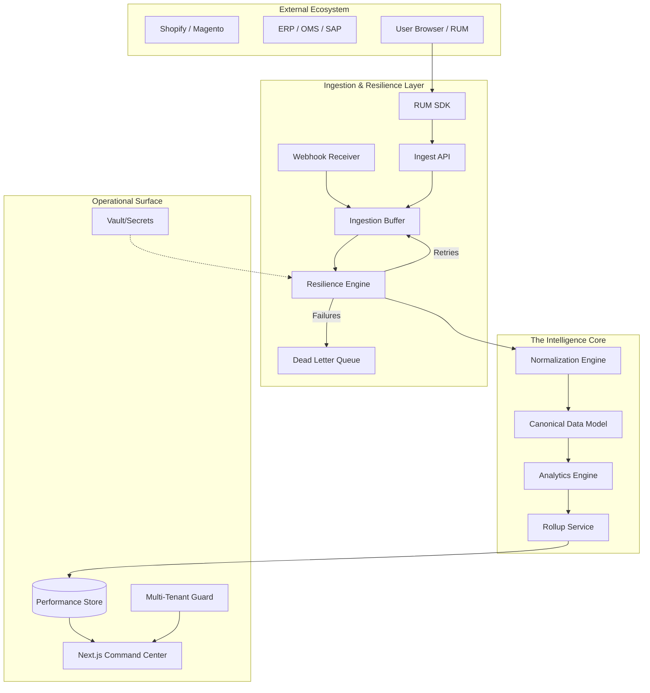

# 🌐 E-Commerce KPI Monitoring Platform: The Master Blueprint

> **Enterprise Observability · Multi-Tenant Resilience · High-Density Analytics**

Welcome to the definitive source of truth for the KPI Monitoring Platform. This document consolidates all architectural, operational, and development knowledge required to build, deploy, and maintain the system.

---

## 📑 Table of Contents

1. [Project Overview & System Architecture](#1-project-overview--system-architecture)
2. [Setup & Installation](#2-setup--installation)
3. [How to Use the System (Operational Guide)](#3-how-to-use-the-system-operational-guide)
4. [Folder Structure Explanation](#4-folder-structure-explanation)
5. [Key Modules & Services](#5-key-modules--services)
6. [API Contracts & Data Flow](#6-api-contracts--data-flow)
7. [Environment Variables & Configurations](#7-environment-variables--configurations)
8. [Development Workflows & Coding Guidelines](#8-development-workflows--coding-guidelines)
9. [Deployment Process](#9-deployment-process)
10. [Monitoring, Logging & Debugging](#10-monitoring-logging--debugging)
11. [Known Issues & Troubleshooting](#11-known-issues--troubleshooting)

---

## 🏢 1. Project Overview & System Architecture

The KPI Monitoring Platform is a production-grade, multi-tenant SaaS observability suite designed specifically for high-density e-commerce environments. It transforms fragmented data from storefronts, backends, and third-party services into actionable operational intelligence.

### High-Level Architecture

The system follows a modular monolith architecture transitioning toward a distributed event-driven model.



### Core Value Pillars
- **Strict Multi-Tenancy**: Complete data isolation between tenants and projects via hardened middleware.
- **Resilient Ingestion**: Buffered intake with exponential backoff and Dead Letter Queues (DLQ).
- **Canonical Data Model (CDM)**: Normalization of disparate schemas into a single transactional truth.
- **Proactive Monitoring**: Synthetic execution of critical business journeys.
- **Failure Intelligence**: Automatic fingerprinting and classification of technical and business failures.

### Persistence & Data Domains
The system uses an **Adapter Pattern** for data persistence, allowing seamless transitions between in-memory mock storage and production databases.
- **Time-Series (metrics)**: In-memory array of KPI records, optimized for `siteId` filtering.
- **Identity (users)**: Map of user profiles containing hashed credentials, roles, and `assignedProjects`.
- **Tenant Context (projects)**: Master registry of shops/sites and their metadata.
- **Incidents (alerts)**: Record of active and historical threshold breaches.

#### Storage Adapters
- **InMemoryTimeSeriesAdapter**: Handles high-frequency metric ingestion and retrieval.
- **InMemoryRelationalAdapter**: Handles configuration, alert states, and IAM.
- **PostgresAdapter**: (Production) Durable persistence for relational and transactional data.

---

## 🛠️ 2. Setup & Installation

### Prerequisites
- **Node.js**: v18 or higher (LTS recommended).
- **Package Manager**: `npm` (v9+).
- **Operating System**: Windows/Linux/macOS supported.

### Quick Start (Local Development)

1.  **Clone and Install**:
    ```bash
    git clone <repository_url>
    cd kpi-monitoring
    npm install
    ```

2.  **Initialize Environment**:
    Create a `.env` file in the root based on the template (see [Configuration section](#6-environment-variables--configurations)).

3.  **Start Services**:
    ```bash
    # Starts API and Dashboard in parallel
    npm run dev
    ```

4.  **Verify Setup**:
    Open [http://localhost:3000](http://localhost:3000) for the Dashboard.
    The API runs on [http://localhost:4000](http://localhost:4000).

---

## 📖 3. How to Use the System (Operational Guide)

This section provides a step-by-step guide for operators, administrators, and developers to interact with the platform.

### 1. Step-by-Step Usage Guide

#### A. Starting and Accessing the System
1. Follow the [Setup Instructions](#2-setup--installation) to start the local environment.
2. Navigate to `http://localhost:3000` in your browser.
3. **Login**: Use the default credentials (e.g., `superadmin@monitor.io` / `password123`) on the landing page to enter the Command Center.

#### B. Onboarding a New Project
1. From the **Portfolio Overview**, click the **"Add Project"** button.
2. Provide a **Project Name** and a unique **Site ID** (e.g., `shopify_store_prod`).
3. Assign the project to a **Tenant** and set the default timezone/currency.
4. Once created, you will be redirected to the Project Dashboard.

#### C. Configuring Integrations (Connectors)
1. Go to the **Integrations** module from the sidebar.
2. Select a connector type (Shopify, Magento, SAP, etc.) from the **Integration Catalog**.
3. Enter the required API credentials (Base URL, API Key, Secret).
4. Click **"Verify & Connect"**. The system will perform a handshake and start the discovery phase.
5. Once active, the **Connector Health Index (CHI)** will begin tracking the sync status.

#### D. Navigating the Dashboard
- **Portfolio View**: A high-level list of all projects you have access to.
- **Project Overview**: The primary "Control Tower" for a specific site, showing real-time revenue, orders, and health scores.
- **Module Navigation**: Use the sidebar to deep-dive into specific diagnostics like **RUM**, **Backend API**, or **Failure Intel**.

---

### 2. User Roles & Access Control

The platform enforces strict Role-Based Access Control (RBAC):

| Role | Permissions | Visibility |
| :--- | :--- | :--- |
| **Super Admin** | Full system control, user management, global config. | Can see all tenants, projects, and system-level logs. |
| **Admin** | Manage project settings, add/remove project-level users. | Restricted to assigned projects; can view all project modules. |
| **Viewer** | View-only access to dashboards and reports. | Restricted to assigned projects; cannot modify configurations. |
| **Contributor** | Can acknowledge alerts and manage incidents. | Restricted to assigned projects; limited write access to operations. |

---

### 3. UI Navigation Overview

The interface is designed as an **Operational Command Center**:

- **Top Bar**: Displays the current project context, global search, and user profile.
- **Sidebar**:
    - **Command Center**: Overview, Active Alerts, and Open Incidents.
    - **Operational Surface**: Technical modules (Performance, RUM, Backend API).
    - **Intelligence**: Business-focused modules (Audience, Orders, Journeys).
    - **Management**: Configuration, Users, and Audit Logs.
- **Main Content**: A high-density grid system (12-column) optimized for real-time monitoring.

---

### 4. Key Workflows

#### Project Onboarding Workflow
`Create Project` → `Generate API Key` → `Instrument Storefront (RUM SDK)` → `Connect Backend (OMS/ERP)` → `Validate Data Stream`.

#### Monitoring & Alerting Workflow
1. **Signal Intake**: Ingestion pipeline receives a spike in 5xx errors.
2. **Alert Trigger**: `AlertEngine` breaches the 5% threshold and generates an alert.
3. **Incident Creation**: The alert is automatically clustered into a new **Critical Incident**.
4. **Notification**: Super Admins receive a high-priority notification via the dashboard and configured webhooks.
5. **Resolution**: Operator investigates via the **Failure Intelligence** module and resolves the incident.

#### Issue Identification Workflow
`Check Health Score` → `Identify Degradation Layer` → `Drill-down into Module (e.g., Synthetic)` → `View Evidence (Screenshot/Logs)` → `Fix & Verify`.

---

### 5. Best Practices
- **Strict Site-Key Usage**: Never share API keys across projects. Generate a unique key for every ingestion source.
- **Proactive Synthetic Checks**: Configure synthetic journeys for your most critical business flows (e.g., "Add to Cart") to catch regressions before users do.
- **Regular Audit Reviews**: Periodically check the **Governance Audit Trail** to ensure no unauthorized configuration changes were made.
- **Data Quality Gates**: Monitor the `qualityScore` of incoming orders; a drop usually indicates a breaking change in an upstream system's schema.

---

### 6. Visual Flow Description
1. **The Entry Point**: Users land on a glassmorphic login screen, emphasizing a secure entry to the enterprise system.
2. **The Portfolio**: A grid of cards representing every monitored site, with mini-sparklines showing 24h trends.
3. **The Control Tower**: The primary dashboard features a "System Health Matrix" at the top, followed by interactive charts for Revenue and Latency.
4. **The Incident Side-Panel**: When an alert is clicked, a diagnostic drawer slides in from the right, providing immediate context without losing page state.

---

## 📂 4. Folder Structure Explanation

The repository is organized as a monorepo for maximum code reuse and consistency.

| Directory | Purpose |
| :--- | :--- |
| `apps/api` | The core Fastify backend handling logic, ingestion, and management. |
| `apps/dashboard` | Next.js 14+ frontend with a high-density "Control Tower" UI. |
| `apps/synthetic-agent` | Headless runner for proactive journey monitoring. |
| `packages/ui` | Shared component library (buttons, cards, tables, layouts). |
| `packages/db` | In-memory and persistence adapters (Drizzle ORM). |
| `packages/shared-types` | Unified TypeScript interfaces and Zod schemas. |
| `packages/connector-framework` | The plugin architecture for external system integrations. |
| `agent/js-monitoring-agent` | The client-side RUM SDK for browser telemetry. |
| `infra/` | Terraform, Docker, and K8s configuration files. |
| `services/` | Standalone background processors (Processor, Alert Engine). |

---

## 🧩 5. Key Modules & Services

### Ingestion Pipeline
Handles the arrival of high-volume telemetry.
- **Hardened Ingestion**: Validates payloads against CDM schemas before acknowledgment.
- **Transformation Pipeline**: Enriches raw events with tenant metadata and channel inference.

### Analytics Engine
Computes real-time KPIs and trends.
- **Rollup Service**: Aggregates atomic events into hourly/daily performance buckets.
- **Order Intelligence**: Performs multi-dimensional analysis on transactional flows and reconciliation status.

### Alerting & Incident Center
The proactive "Brain" of the platform.
- **Alert Engine**: Evaluates metrics against thresholds (e.g., Latency > 3s).
- **Incident Manager**: Clusters alerts into managed incidents with status tracking (OPEN → RESOLVED).

### Synthetic Monitoring
- **Journey Runner**: Simulates user flows (PDP → Add to Cart → Checkout).
- **Scheduler**: Orchestrates checks across globally distributed agents.

---

## 🔌 6. API Contracts & Data Flow

### Authentication Flow
1. **User Login**: `POST /api/v1/auth/login` → Returns JWT Bearer Token.
2. **Telemetry**: Header `x-api-key` required for all ingestion endpoints.

### Core Endpoints

| Endpoint | Method | Purpose |
| :--- | :--- | :--- |
| `/api/v1/i/server` | POST | Bulk server-side event ingestion. |
| `/api/v1/i/frontend` | POST | Browser telemetry (RUM) intake. |
| `/api/v1/dashboard/summaries` | GET | KPI card data with trends. |
| `/api/v1/projects/:id/integrations` | GET | Status and health of system connectors. |

### Data Normalization Flow
1. **Source Event** (Shopify/ERP) → **Webhook Receiver**.
2. **Raw Capture** → Persisted in Ingestion Buffer.
3. **Normalization** → Fields mapped to CDM (e.g., `hdr_amt` → `amount`).
4. **Enrichment** → Channel and Tenant tags added.
5. **Persistence** → Canonical Record saved to Performance Store.

---

## ⚙️ 7. Environment Variables & Configurations

Create a `.env` file in `apps/api` and `apps/dashboard`.

```env
# API Configuration
PORT=4000
NODE_ENV=development
API_VERSION=v1

# Security
JWT_SECRET=your_super_secret_key_change_in_prod
ENCRYPTION_KEY=32_char_hex_for_aes_vault

# Multi-Tenancy
STRICT_ISOLATION_ENABLED=true

# Dashboard (Frontend)
NEXT_PUBLIC_API_URL=http://localhost:4000
```

---

## 👨‍💻 8. Development Workflows & Coding Guidelines

### UI/UX Standards
- **Styling**: Use the standardized CSS variables in `packages/ui` and `apps/dashboard/src/app/globals.css`.
- **Components**: Always prefer components from `@kpi-platform/ui` over ad-hoc elements.
- **Responsive**: Mobile-first approach using the 12-column dashboard grid system.

### Backend Best Practices
- **Strict Typing**: Every service must use types from `@kpi-platform/shared-types`.
- **Defensive Coding**: Use optional chaining and nullish coalescing for all store lookups.
- **Validation**: All Inbound requests must be validated using Zod schemas in `middlewares/validation.ts`.

### Removal of Mock Data
> [!IMPORTANT]
> All hardcoded mocks, `Math.random()` seeds, and static fallbacks have been removed. Always source data from the `GlobalMemoryStore` or the appropriate service layer.

---

## 🚀 9. Deployment Process

### Docker & Orchestration
1. **Build**: `docker build -f infra/docker/api.Dockerfile -t kpi-api .`
2. **Compose**: Use `docker-compose up` in the `infra` folder for local full-stack simulation.

### Production Scaling
- **API**: Target tracking auto-scaling based on CPU (>70%).
- **Database**: Amazon RDS with Multi-AZ for high availability.
- **CI/CD**: Managed via GitHub Actions (`.github/workflows/cd.yml`).

---

## 🔍 10. Monitoring, Logging & Debugging

### Internal Observability
- **Connector Health Index (CHI)**: Tracked in `IntegrationManagementPage`.
- **System Audit Trail**: Available via `GET /api/v1/access-control/audit`.

### Debugging Tools
- **Logs**: Structured JSON logs emitted by all services.
- **Memory Store**: Inspect `GlobalMemoryStore` in the API console during development to see live state.
- **Trace IDs**: Use `correlationId` to link frontend errors to backend API failures.

---

## 🆘 11. Known Issues & Troubleshooting

- **No Data in Dashboard**: 
    - Verify `siteId` matches between the UI URL and the ingested data.
    - Check API logs for "Payload Rejected" (CDM validation failure).
- **Auth Failures**: Ensure the `Authorization: Bearer <token>` header is present in dashboard requests.
- **Integration Offline**: Check the "Vault Service" for expired credentials or connector timeouts.

---
*Architecture Documentation · 18th Observability Platform · 2026*
