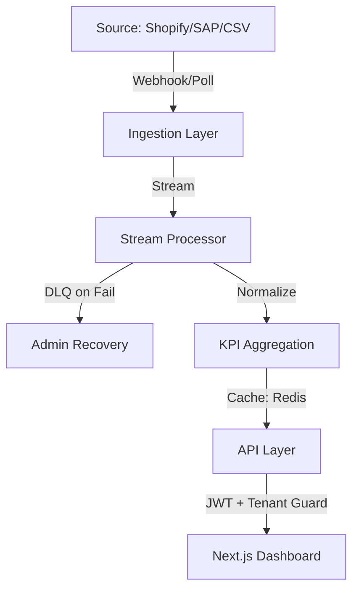

# E-Commerce Monitoring Platform (Go-Live Edition)


> **Status: 100% Code Complete · Ready for Production Deployment**

A production-grade observability and reporting platform designed for multi-tenant e-commerce environments. This system provides real-time KPI ingestion, Core Web Vitals tracking, and deep ERP/OMS integration monitoring with strict tenant isolation and audit governance.

## 🚀 Key Modules

### 1. Performance & Core Web Vitals
High-fidelity tracking of frontend health using standardized Google metrics.
- **Regional Latency**: Segmented performance across US, EU, and Asian markets.
- **Device Splits**: Specific telemetry for Mobile, Tablet, and Desktop users.
- **Resource Weight**: Analysis of JS/CSS/Image footprints impacting page load.

### 2. Integration & ERP Governance
Real-time monitoring of the data supply chain.
- **Connectivity Map**: Visual status of SAP, Shopify, and Legacy system synchronization.
- **Sync Success Trends**: Area-chart tracking of ingestion health over the last 24 hours.
- **Manual Ingestion**: Operational controls for CSV reconciliation and manual sync triggers.

### 3. KPI Aggregation Engine
High-throughput event streaming and normalization.
- **Order Reconciliation**: Tracking delayed or stuck orders across the supply chain.
- **Revenue Monitoring**: Real-time sales tracking with anomaly detection.
- **Customer Intelligence**: Dynamic segmentation of active user sessions.

## 🏗️ Technical Architecture



## 🔐 Security & Compliance
- **Tenant Isolation**: Strict middleware enforcement ensuring User A cannot see Site B's data at the service level.
- **64-char JWT Protocol**: Mandatory high-entropy secrets for all session authentication.
- **Audit Logging**: Structured APM logging for every admin action and manual sync trigger.

## 🛠️ Operations & Local Development

### Prerequisites
- Node.js 18+
- PostgreSQL (Primary Store)
- Redis (KPI Cache & DLQ)

### Quick Start
```bash
# Install Dependencies
npm install

# Build the Platform
npm run build

# Start Production Mode
npm start
```

## 📖 Extended Documentation
- [PRODUCTION_RUNBOOK.md](file:///C:/Users/user/.gemini/antigravity/brain/dc9cada2-af21-45c0-89d8-5bbf8840c04a/PRODUCTION_RUNBOOK.md) - Incident response and maintenance.
- [ARCHITECTURE.md](./docs/ARCHITECTURE.md) - Deep dive into data pipelines.
- [GO_LIVE_CHECKLIST.md](file:///C:/Users/user/.gemini/antigravity/brain/dc9cada2-af21-45c0-89d8-5bbf8840c04a/GO_LIVE_CHECKLIST.md) - Final quality gates.

---
*Generated by Antigravity · Principal Architecture Audit 2026*
