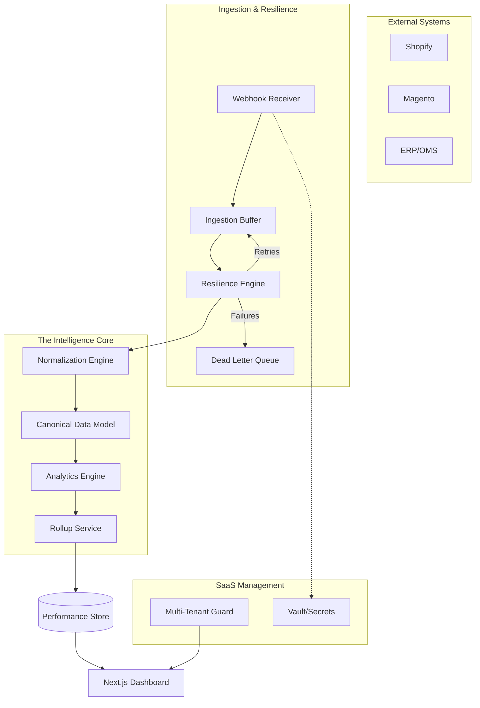

# E-Commerce KPI Monitoring Platform

> **Status: Advanced Multi-Tenant SaaS Architecture Active**

A production-grade, multi-tenant observability platform designed for high-density e-commerce monitoring. The system has been evolved from a flat MVP into a resilient, intelligent, and self-healing architecture built for scale.

---

## 🚀 Advanced Architecture Features (NEW)

### 1. 🏢 Multi-Tenant SaaS Foundation
Strict hierarchical data partitioning that ensures enterprise-grade security and isolation.
- **Tenant > Project Mapping**: Projects are grouped under independent Tenants for administrative isolation.
- **Hardened Isolation Middleware**: Every API request is verified for cross-tenant leakage before execution.
- **Role-Based Access**: Granular control over platform management and data visibility.

### 2. 🔌 Configuration-Driven Connector Framework
A plugin-style architecture for rapid integration with a standardized "One-time connection" model.
- **Lifecycle Logic**: Standardized stages for `Connect`, `Validate`, `Discover`, `Sync`, and `Reconcile`.
- **Vault Service**: Sensitive API credentials (Shopify, Magento, ERP) are protected using **AES-256-GCM** encryption at rest.
- **Low-Touch Onboarding**: API-driven discovery flow that inspects source systems for available capabilities.

### 3. 🛡️ Resilient Ingestion & DLQ
A high-throughput ingestion layer designed for fault tolerance and zero data loss.
- **Buffered Intake**: Incoming webhooks are acknowledged in milliseconds and persisted raw before transformation.
- **Retry Engine**: Exponential backoff for transient failures (e.g., source API timeouts).
- **Dead Letter Queue (DLQ)**: Failed events are automatically quarantined for manual replay or system "Self-Healing."

### 4. 💎 Canonical Data Model (CDM)
A unified "Transactional Truth" that normalizes fragmented data from diverse commerce engines.
- **Normalization Engine**: Translates Shopify, Magento, and ERP payloads into a standard system schema.
- **Data Quality Gates**: Automated validation scoring for every record (detecting anomalies like overpayment or missing metadata).
- **Order Timeline**: Atomic tracking of every state transition (PLACED → PAID → SHIPPED) with historic snapshots.

### 5. 🧠 Analytics & Rollup Engine
High-fidelity KPI computation optimized for massive transactional datasets.
- **Computed KPIs**: Standardized math for Revenue, Average Order Value (AOV), and Tax Concentration.
- **Rollup Aggregation**: Pre-computed hourly and daily buckets for sub-second dashboard performance.
- **Multi-Dimensional Filters**: Segment analytics by Channel, Region, TimeRange, and Browser context.

### 6. 🚨 Operational Observability & Health
Proactive system signals that monitor the monitoring platform.
- **Connector Health Index (CHI)**: A 0-100 executive score representing the reliability of every integration instance.
- **Alerting Engine**: Anomaly detection for sync failures, ingestion backlogs, and data quality degradation.
- **Governance Audit Trail**: Immutable logging of all administrative actions for compliance and accountability.

---

## 🏗️ Technical Architecture



---

## 🛠️ Local Development Setup

### Prerequisites
- Node.js 18+

### Quick Start
```bash
# 1. Install all dependencies
npm install

# 2. Start Advanced API + Dashboard
npm run dev

# 3. Trigger Platform Validation
# Verifies Isolation, Resilience, and CDM logic
npm run test:platform
```

---

## 📖 Extended Documentation
- **[Connector Framework](./packages/connector-framework/README.md)** - Plugin development guide
- **[API Integration Specification](./API_INTEGRATION.md)** - Full production reference
- **[Advanced Roadmap History](./phase_1_checklist.md)** - Implementation log

---
*Architecture: Antigravity Production Observability Platform · 2026*
