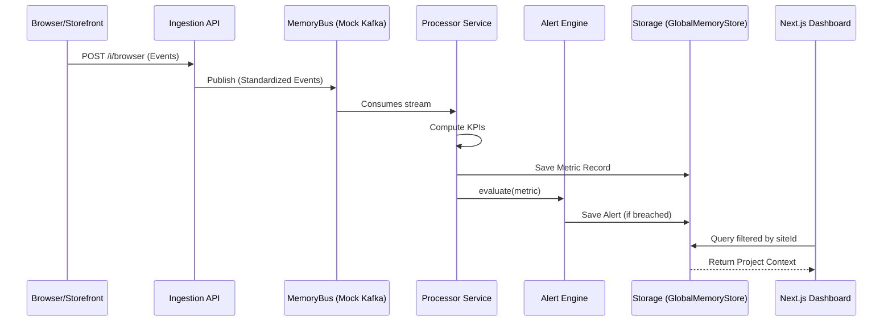

# Platform Architecture

This document provides a deep technical dive into the architecture of the E-Commerce Monitoring platform, including its multi-tenant SaaS foundation and role-based access control (RBAC).

## 1. System Overview

The platform is built as a **modular, event-driven ecosystem** designed to handle high-frequency telemetry from multiple projects without affecting the performance of the monitored applications. 

### Key Design Principles:
- **Tenant Isolation**: Strict data sandboxing at the API and Storage layers.
- **Asynchronous Processing**: Non-blocking ingestion via a simulated message bus.
- **Stateless Verification**: Every request is validated for role and project membership at the boundary.

## 2. Multi-Tenant Role Model

The platform enforces a granular RBAC system across three distinct user profiles:

| Role | Access Level | Data Scope |
| :--- | :--- | :--- |
| **Super Admin** | Full Read/Write | **Global**: Access to all projects and configurations. |
| **Admin** | Full Read/Write | **Scoped**: Access only to assigned projects. |
| **Customer** | View-Only | **Scoped**: Read-only access to assigned projects. |

### Access Control Mechanism
- **Backend**: Every sensitive route uses `tenantAuthHandler` to verify session tokens and `siteId` membership. Mutation routes are further protected by `viewOnlyGuard`.
- **Frontend**: A global `RoleGuard` component wraps administrative routes, while navigation elements (Sidebar, TopBar) are dynamically purged based on user role.

## 3. Layered Architecture

### A. Telemetry Layer (Edge)
- **JS Monitoring Agent**: A non-blocking script injected into the storefront.
- **Server Events**: Direct API calls from order management or inventory systems.

### B. Ingestion Layer (Fastify)
- **Validation**: Schema-level verification for incoming event batches.
- **Context Enrichment**: Attaches `siteId` and internal timestamps before handoff.
- **Bus Handoff**: Publishes to the internal `MemoryBus`.

### C. Processing Tier (Stream Processing)
- **Aggregation Service**: Computes business KPIs (Conversion, Page Load, Sync Health) using sliding windows.
- **Rule Evaluator**: Stateless logic that compares current metrics against site-specific thresholds defined in `packages/config`.

### D. Presentation & API
- **Dynamic Switcher**: Allows Admins/Super Admins to toggle between projects while maintaining a consistent dashboard state.
- **Context-Aware Metrics**: Queries aggregate metrics strictly filtered by the active project context.

## 4. End-to-End Data Flow

## 5. Persistence Strategy

In the current delivery, persistence is handled by the **Modular In-Memory Adapter**.
- **Interfaces**: Defined in `packages/db` to allow seamless swapping with persistent SQL (PostgreSQL) or NoSQL (Redis/ClickHouse) drivers.
- **GlobalMemoryStore**: A singleton that maintains cross-service data integrity within a single process.

## 6. Future Scalability

- **Kafka Migration**: Replace `MemoryBus` with a production broker for distributed resilience.
- **Time-Series DB**: Move metric storage to a specialized time-series database for long-term historical trending.
- **MFA & SSO**: Integration with OIDC/OAuth for enterprise-grade authentication.
