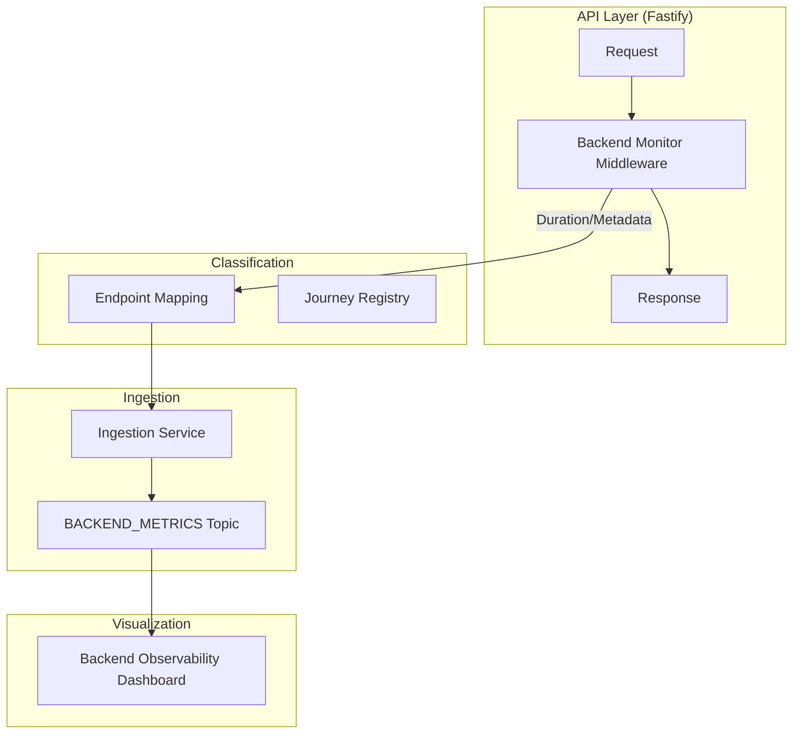

# Phase 2: Backend Performance & API Monitoring

## Overview
Phase 2 implements a production-grade observability layer for backend APIs and services. It enables the platform to monitor latency distribution (P50, P95, P99), status code health, and journey-aware performance across all commerce flows.

## Architecture

## Instrumentation Design
The monitoring is implemented via a Fastify `onResponse` hook in `apps/api/src/server.ts`. This ensures:
- **Zero-Block Execution**: Metrics are captured after the response is sent.
- **Accuracy**: Uses `reply.getResponseTime()` for high-precision timing.
- **Fail-Safe**: Errors in metrics collection are caught and logged, never impacting the user request.

## Endpoint Classification
Endpoints are automatically mapped to commerce journeys using the `ENDPOINT_MAPPING` registry in `src/utils/backend-monitor.ts`.
- **Journeys**: SEARCH, PDP, CART, CHECKOUT, ORDER, AUTH, SYSTEM.
- **Criticality**: CRITICAL, HIGH, NORMAL.

## Captured Metrics
Each API event captures:
- `duration`: Response time in ms.
- `status`: HTTP status code.
- `route`: Pattern-based route (e.g., `/api/v1/products/:id`).
- `journey`: The business flow context.
- `correlationId`: For linkage with frontend telemetry.
- `sessionId`: For user journey correlation.

## Dashboard Features
A new **Backend API** view has been added to the sidebar:
- **Latency Distribution**: Real-time P50/P95/P99 trends.
- **Status Code Health**: Donut chart showing success/error ratios.
- **Slow Endpoints Table**: Ranked list of APIs exceeding performance thresholds.
- **Journey Health Rollup**: High-level status of critical business flows.

## Troubleshooting
- **No data appearing**: Check if the `X-Session-ID` header is being passed from the frontend for correlation.
- **Inaccurate timings**: Ensure the server is not under extreme CPU pressure which might skew `onResponse` hooks.
- **Missing Endpoints**: Add new URL patterns to the `ENDPOINT_MAPPING` in `src/utils/backend-monitor.ts`.
