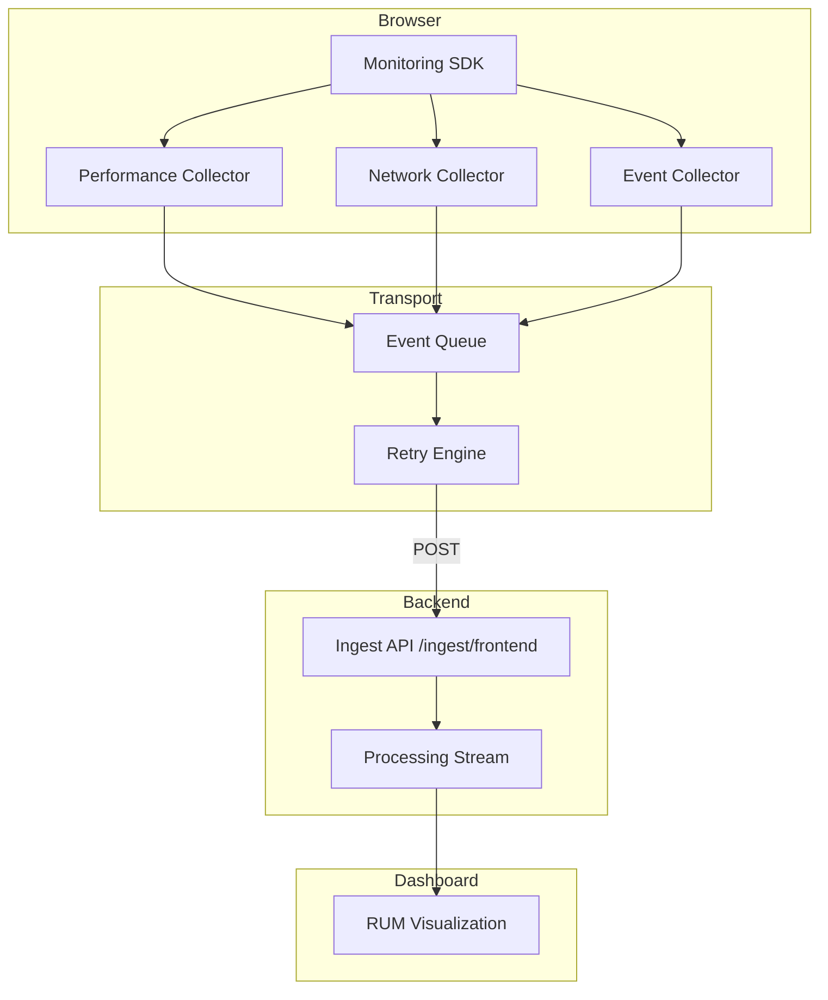

# Phase 1: Frontend Telemetry (RUM Layer)

## Overview
The Frontend Telemetry (Real User Monitoring - RUM) layer provides deep visibility into the actual experiences of users on storefronts (Magento, Shopify, and Custom SPAs). It captures performance metrics, interaction signals, and network reliability directly from the browser.

## Architecture


## SDK Integration Guide

### Generic Integration (UMD)
Add the following script to your `<head>` or before the closing `</body>` tag:

```html
<script src="https://cdn.yourdomain.com/rum-sdk.global.js"></script>
<script>
  MonitoringSDK.init({
    projectId: "your_project_id",
    endpoint: "https://api.yourdomain.com/api/v1/ingest/frontend",
    samplingRate: 1.0 // 100% of sessions
  });
</script>
```

### Magento (Adobe Commerce)
Inject the script via `layout.xml` or a custom module in `app/code`:
```xml
<referenceContainer name="after.body.start">
    <block class="Magento\Framework\View\Element\Template" name="rum_telemetry" template="Vendor_Module::rum.phtml" />
</referenceContainer>
```

### Shopify
Add the snippet to `layout/theme.liquid`.

## Configuration Options
| Option | Type | Default | Description |
|--------|------|---------|-------------|
| `projectId` | string | **Required** | The site/project identifier. |
| `endpoint` | string | **Required** | The ingestion API URL. |
| `userId` | string | optional | Connect telemetry to a specific user. |
| `samplingRate` | number | 1.0 | Frequency of capture (0.0 to 1.0). |

## Event Schema
All events follow a standard JSON structure:

```json
{
  "siteId": "store_001",
  "events": [
    {
      "eventType": "performance_metrics",
      "timestamp": "2024-04-23T12:00:00Z",
      "sessionId": "s123...",
      "metadata": {
        "metric": "LCP",
        "value": 1200,
        "rating": "good"
      }
    }
  ]
}
```

## Performance Metrics Explained
- **LCP (Largest Contentful Paint)**: Measures loading performance. Target: < 2.5s.
- **INP (Interaction to Next Paint)**: Measures responsiveness. Target: < 200ms.
- **CLS (Cumulative Layout Shift)**: Measures visual stability. Target: < 0.1.
- **TTFB (Time to First Byte)**: Measures server response time. Target: < 800ms.

## Troubleshooting
- **SDK not sending events**: Check `samplingRate` and ensure the `endpoint` is reachable (CORS).
- **Missing Metrics**: Some older browsers do not support `PerformanceObserver`. The SDK fails gracefully.
- **High Latency**: Events are batched (default: 20 events or 5 seconds) to minimize network overhead.
